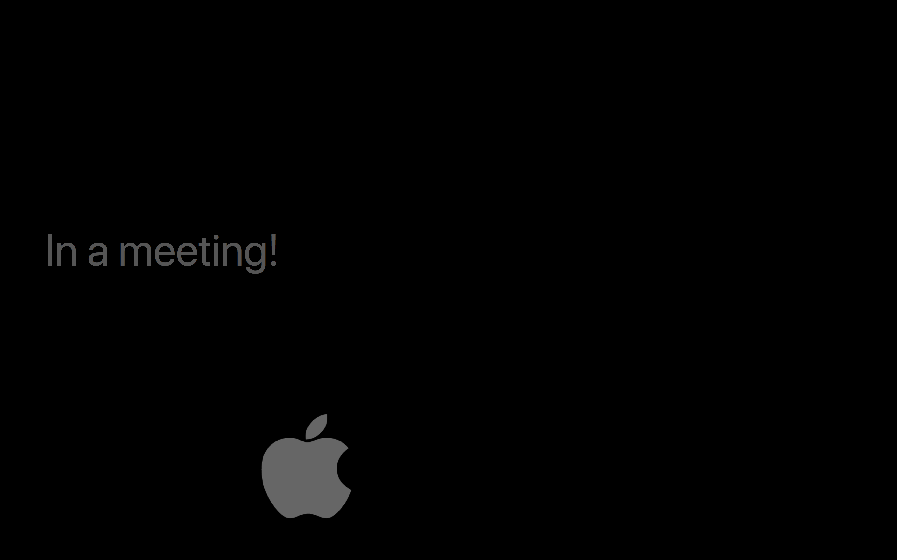
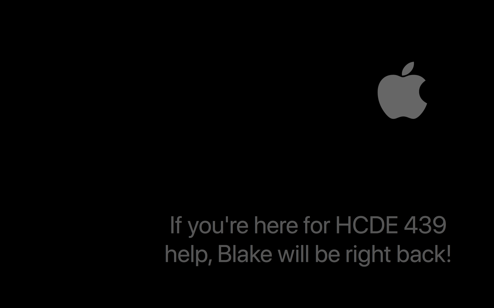
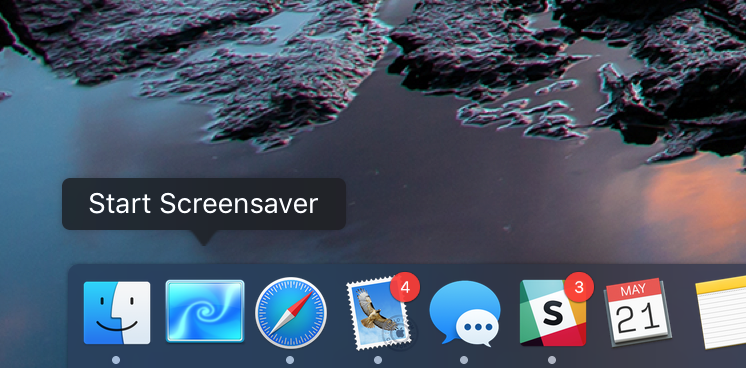
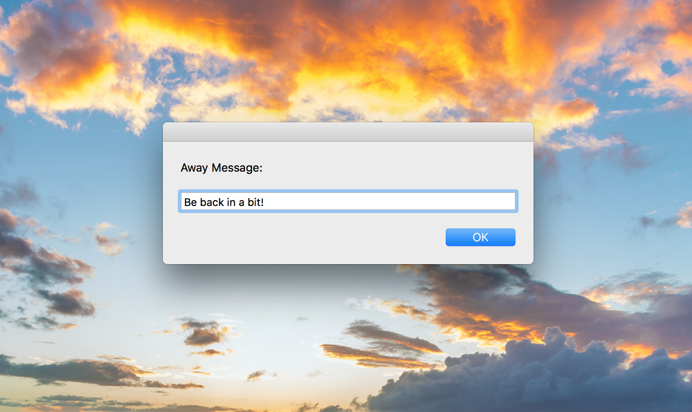
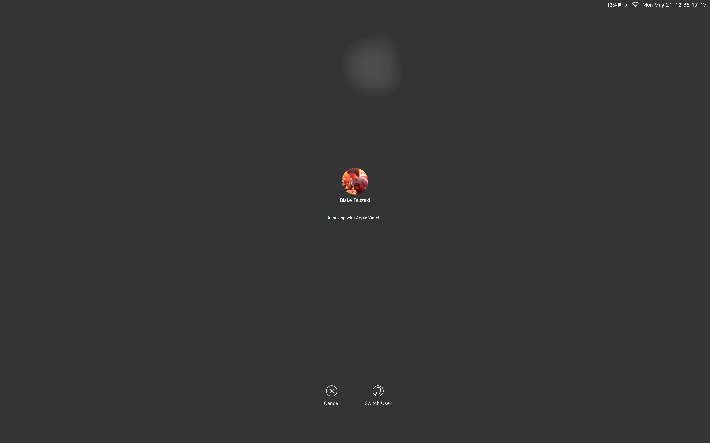

# I Am Away
Simple, nonintrusive away messages for macOS

## Introduction
Leaving your computer during the work day is a tricky task. This script uses macOS's the built-in `Message` screensaver to quickly set an away message.

I wrote this script in Summer '16 so I wouldn't get GOAT'ed1 by [@waynecrasta](https://github.com/waynecrasta), [@mikeecb](https://github.com/mikeecb), [@schopra8](https://github.com/schopra8), [@JoshuaChing](https://github.com/joshuaching), [@karanh](https://github.com/karanh), [@allen-gao](https://github.com/allen-gao), [@mitchellgordon95](https://github.com/mitchellgordon95), [@geneyoo](https://github.com/geneyoo), [@sup](https://github.com/sup), and all my other [@Yelp](https://github.com/yelp) friends on 14F. This project was inspired by the [AIM Away Message](https://medium.com/the-romantic-huckster/the-art-of-the-aim-away-message-df732a7df289) and I'm opening it up upon the [death of AIM](https://twitter.com/aim/status/916290747850264577).

It's much simpler and easier than [using System Preferences every time you need a break.](http://osxdaily.com/2012/10/21/custom-screen-saver-message-mac-os-x/)

These days, I use it when I need to step away from my computer during office hours to let my students know where I am:

## Usage
- Place the script anywhere that's convenient. You can even wrap it in an app and add it to your dock as I do:

- When you run the script, it will prompt you for an away message:

- Once you click `OK`, the screensaver will automatically start with your message.
- The Automator script exits, and the screensaver should still work as it normally does, prompting you for a password, if you have one, or unlocking with your Apple Watch:

## Notes & FAQ
- You may need to set the `Messages` screensaver text to some value to ensure macOS has a value saved for it.
- **Q: Why is this an Automator script?**
  - Different versions of macOS have different ways of starting the screensaver. Rather than trying to deal with the nuances of each version, Automator can do this for you.
- **Q: Did this really stop you from getting GOAT'ed?**
  - No. And to this day, I'm still salty for getting GOAT'ed and not figuring out who did it.
- If you have any other questions or wanna chat ☕️ let me know!

## License
MIT

1 [GOATing](http://google.com/search?q=goat) is a prank people play on each other for walking away from their computers unlocked
